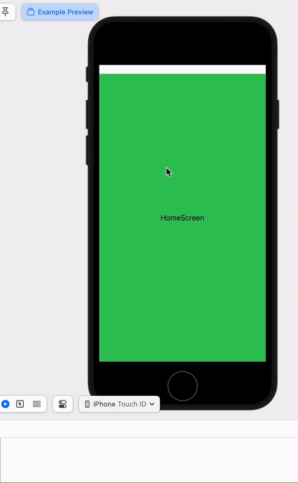

### Contents

Package provides two simple things to create a navigation drawer with a swipe gesture
- modifier struct `NavigationDrawerModifier`
- extension function `navigationDrawerModifier()`

### Usage

As seen in the `ExampleApp`, the only way to create a navigation drawer with a swipe gesture is
by using the `navigationDrawerModifier` extension function. The view onto which this
modifier is applied should have a `frame` because the `DragGesture` for swipe uses
this frame's bounds.

    GeometryReader() { geometry in
        ZStack(alignment: .topLeading) {
            HomeScreen()
        }
        .frame(width: geometry.size.width,
               height: geometry.size.height)
        .navigationDrawerModifier(geometry: geometry,
                                  scrimColor: UIColor.black,
                                  drawerColor: UIColor.systemTeal,
                                  drawerContent: drawerContent() as! AnyView,
                                  navigationDrawerState: $navigationDrawerState,
                                  navigationDrawerDisabledState: navigationDrawerDisabledState)
    }

#### Description

- **geometry**: Represents the layout of the main view onto which the drawer is attached.
- **scrimColor**: Color of the transparent overlay to tint the drawer content background.
- **drawerColor**: Color of the drawer view itself.
- **drawerContent**: An `AnyView` that defines the content to display within the drawer.
- **navigationDrawerState**: A `Binding` to the opened/closed state of the navigation drawer.
- **navigationDrawerDisabledState**: A `Binding` to the disabled state of the navigation drawer.

#### Details

The `navigationDrawerState` parameter above is a `@Binding` to a correponding
drawer state, which can be created in the following manner. Its purpose is to
update the opened/closed state of the drawer. The `navigationDrawerDisabledState`
is a binding to modify the swipe gesture functionality to entirely disable the
drawer from appearing, if its value is set to `true`. This value can be modified
between screens.

    @State private var navigationDrawerState: NavigationDrawerState = .closed
    @State private var navigationDrawerDisabledState: Bool = false

The latest **update** in the `ExampleApp` performs an extra step in the drawer
`Option` button, where setting the drawer state to `closed` causes the drawer to
close, just like it would normally close with a swipe gesture.

    Button("Option") {
        print("drawer option clicked")
        navigationDrawerState = .closed
    }

### Platforms

- macOS v13 and above
- iOS v16 and above

### Example

